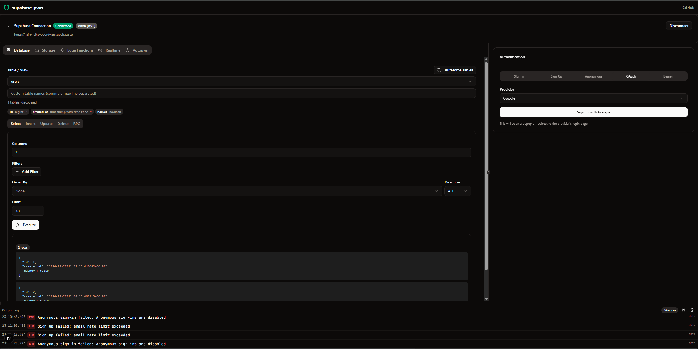
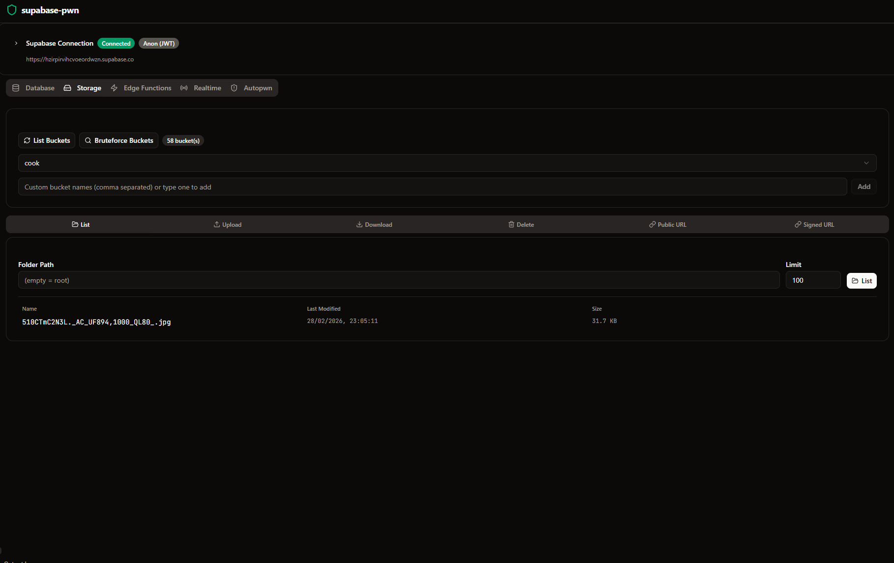

<p align="center">
  
</p>

<h1 align="center">supabase-pwn</h1>

<p align="center">
  <strong>The Supabase security testing toolkit for pentesters.</strong><br>
  Point it at any Supabase project URL + API key and start probing for misconfigurations — exposed tables, broken RLS policies, open signups, leaky storage buckets, unprotected edge functions, and more.
</p>

<p align="center">
  <a href="#features">Features</a> · <a href="#getting-started">Getting Started</a> · <a href="#usage">Usage</a> · <a href="#screenshots">Screenshots</a> · <a href="#tech-stack">Tech Stack</a> · <a href="#project-structure">Project Structure</a>
</p>

> **For authorized security testing only.** Always get explicit permission before testing projects you don't own.

Inspired by [firepwn-tool](https://github.com/0xbigshaq/firepwn-tool) (Firebase security testing), built for the Supabase ecosystem.

---

## Features

### Recon & Dashboard

- **Recon Dashboard** — Overview screen with live stats: tables found, exposed data, key type, findings summary, and recent clues — one-click navigation to any module
- **Auto-Extract Config** — Paste any web app URL and supabase-pwn crawls its JS bundles looking for Supabase project URLs, API keys (anon, service_role, publishable, secret), `.from()` table names, `.rpc()` functions, and `.functions.invoke()` edge function names
- **Key Type Auto-Detection** — Automatically identifies anon, service_role, publishable, and secret keys from prefix or JWT payload; badge shown in the header

### Database

- **Database Explorer** — Full CRUD (SELECT / INSERT / UPDATE / DELETE) against any discovered table with a filter builder, fake-data auto-fill, column picker, and PATCH/PUT method toggle
- **Table & Column Bruteforcer** — When the OpenAPI schema is blocked (publishable keys), bruteforce ~130+ common table names with custom wordlist support; second pass bruteforces columns on blocked tables
- **RPC Invoker** — Discover functions from the OpenAPI spec, see expected parameters, auto-populate args and invoke
- **Relationship Traversal (Embedding)** — "Embed" selector on SELECT appends `?select=*,related_table(*)` to probe foreign-key relationships and pull nested data
- **Mass-Assignment / Escalation Test** — "Escalate" button on INSERT tests for privilege escalation by injecting role/admin fields and detecting if the write succeeds
- **RLS Policy Analyzer** — Static analysis of RLS policies (imported from schema dump): detects `USING (true)`, missing `WITH CHECK`, no `auth.uid()` references, and ranks issues by severity (critical/high/medium/info)

### Storage

- **Storage Explorer** — List buckets, browse files, upload/download/delete, generate public & signed URLs
- **Bucket Sensitivity Badges** — Buckets with sensitive names (backup, credentials, private, etc.) flagged with 🔎 in the selector
- **Sensitive File Detection** — Files like `.env`, `dump.sql`, `backup.tar.gz` flagged during listing

### Auth

- **Auth Probing** — Test sign-up, sign-in, anonymous auth, OAuth redirects, password reset, and inject bearer tokens
- **Provider Enumeration** — Tests multiple OAuth providers (Google, GitHub, Apple, etc.) and auth methods

### Edge Functions

- **Edge Function Invoker** — Invoke edge functions with custom bodies, headers, and auth tokens
- **Function Discovery** — "Discover" button bruteforces common function names with chips for found functions

### Realtime

- **Realtime Monitor** — Subscribe to postgres_changes, broadcast events, and presence tracking on any channel
- **Secret Scanning in Events** — Incoming realtime payloads are scanned for leaked secrets/JWTs

### Automated Scanning

- **AutoPwn Scanner** — Automated multi-phase scan covering Database RLS, Storage, Auth, and Edge Functions with configurable concurrency and custom table names
- **Findings Engine** — Turns raw scan results into ranked vulnerabilities (critical → info) with evidence, remediation steps, and PII escalation
- **Scan History & Diff** — Persisted scan results with before/after comparison: new findings (red), fixed findings (green strikethrough), and delta summary
- **Navigable Findings** — Click any finding to jump to the affected table/bucket in the right module
- **Markdown Report Export** — "Export session report (.md)" generates a full pentest report with findings table, evidence, and remediation

### Intelligence & Detection

- **Sensitive Column Detection** — Flags columns named password, email, ssn, cpf, credit_card, api_key, etc. with PII badges
- **Secret Value Detection** — Scans actual cell values for JWTs, AWS keys, Stripe keys, private keys, Supabase keys, emails, bcrypt hashes — even in innocuously-named columns
- **JWT Decoder** — Automatically decodes JWTs found in data, showing role, expiration, and flags service_role leaks as CRITICAL
- **Clue System** — All sensitive detections are tagged as 🔎 CLUE in the output log with a dedicated filter chip

### Developer Experience

- **Copy-as-cURL** — Every request (SELECT, INSERT, UPDATE, DELETE, RPC, Edge Function, Storage) has a `curl` button that copies the exact equivalent command
- **Request History & Replay** — Panel with all executed read requests; one-click replay and copy-as-curl for each
- **Output Log** — Color-coded activity log with JSON syntax highlighting, timestamps, expandable payloads, clue filter, and persistent storage (survives page reload, last 500 entries)
- **Telemetry Bar** — Always-visible bottom strip with live counters (INFO/OK/WARN/ERR/🔎), latest log line, and expandable full console; auto-opens on clues or errors

### UI / Design

- **Instrument-Grade Dark UI** — Purpose-built dark theme with monospace typography, datum corners, reticle focus marks, and boot sequence animations
- **Left Rail Navigation** — Icon sidebar: Recon, Database, Storage, Edge, Realtime, Auth, AutoPwn
- **HUD Scan Bar** — Live scan progress with phase indicators (done/active/pending) and sweep animation
- **Skeleton Loading States** — Schematic scan-sweep skeletons for SELECT, Edge, and RPC results
- **Empty States with CTAs** — Context-aware empty states per module ("No table selected", "Connect first", etc.)
- **Resizable Panels** — Split-pane layout with draggable dividers
- **Toast Notifications** — Themed toasts (success/error/warning) matching the instrument aesthetic

---

## Supported API Keys

| Key Type                  | Prefix                             | Access Level                                   |
| ------------------------- | ---------------------------------- | ---------------------------------------------- |
| Publishable               | `sb_publishable_`                  | Low privilege, schema blocked — use bruteforce |
| Secret                    | `sb_secret_`                       | Elevated, bypasses RLS                         |
| Anon (legacy JWT)         | `eyJ...` with `role: anon`         | Low privilege, schema accessible               |
| Service Role (legacy JWT) | `eyJ...` with `role: service_role` | Elevated, bypasses RLS                         |

Key type is auto-detected from the prefix/JWT payload and displayed in the connection header.

---

## Getting Started

### One-command install (Docker)

You only need Docker installed:

```bash
git clone https://github.com/berodcdev/supabase-pwn.git
cd supabase-pwn
./install.sh
```

The installer checks Docker, builds the app, and serves it at **http://localhost:3000** — bound to loopback only, so it's reachable from your machine and needs no login.

**Options:**

| Flag                  | Description                        |
| --------------------- | ---------------------------------- |
| `--port 8080`         | Use a custom port                  |
| `--yes`               | Skip confirmation prompts          |
| `--update`            | Rebuild and restart                |
| `--uninstall`         | Stop, remove container and image   |

### Without cloning (prebuilt image)

Once the GitHub Action builds the image, install on any machine with Docker in one line:

```bash
curl -fsSL https://raw.githubusercontent.com/berodcdev/supabase-pwn/master/install.sh | bash
```

This pulls `ghcr.io/berodcdev/supabase-pwn:latest` and runs it. Requires the repo and GHCR package to be public. From a private setup, use the clone + `./install.sh` route.

### Run from source (development)

```bash
npm install
npm run dev
```

Available scripts:

| Script            | Description                           |
| ----------------- | ------------------------------------- |
| `npm run dev`     | Start dev server (localhost only)     |
| `npm run dev:lan` | Start dev server (LAN accessible)     |
| `npm run build`   | Production build                      |
| `npm run start`   | Start production server               |
| `npm run test`    | Run tests (vitest)                    |
| `npm run typecheck` | Type-check with tsc                |
| `npm run lint`    | Lint with ESLint                      |

### Deploy for a team (Caddy + Authelia + TOTP)

To expose it on a server behind a login screen with one-time-password (authenticator app), see [deploy/README.md](deploy/README.md). The stack uses Caddy for automatic HTTPS and Authelia for SSO + TOTP — only ports 80/443 are exposed.

---

## Usage

### 1. Connect

Enter a Supabase project URL + API key (or paste a web app URL and let **Extract Config** find them automatically). The app fetches the OpenAPI spec to discover tables, columns, and RPC functions. If the spec is blocked, use the **Bruteforce** button.

### 2. Recon Dashboard

After connecting, the Recon dashboard shows an overview: how many tables were found, which are exposed, key type risk level, latest findings, and recent clues. Use the stat cards to jump directly into any module.

### 3. Database

Select a table, build queries with filters, auto-fill insert data with fake values, send SELECT results to the Update tab with one click. Use **Embed** to test relationship traversal and **Escalate** to test mass-assignment. Sensitive columns are highlighted with PII badges, and leaked secrets in values are flagged automatically.

### 4. Storage

List buckets, browse file trees, test upload/download/delete permissions. Sensitive bucket names and filenames (.env, backups, dumps) are flagged. Every operation has copy-as-curl.

### 5. Auth

Try signing up, signing in, creating anonymous sessions, testing OAuth providers, or injecting intercepted JWTs into the Bearer Token tab.

### 6. Edge Functions

Invoke by name with custom request bodies and headers, or use **Discover** to bruteforce common function names. Responses are scanned for leaked secrets.

### 7. Realtime

Subscribe to channels and watch for postgres_changes, broadcasts, or presence events. Payloads are scanned for secrets.

### 8. AutoPwn (Automated Scan)

Configure which phases to run (Database RLS, Storage, Auth, Edge Functions), set concurrency, optionally add custom table names, and hit **Start Scan**. Results appear as a color-coded permission matrix. The findings engine ranks vulnerabilities by severity with evidence and remediation. Export a full Markdown report or compare with previous scans to track what changed.

---

## Screenshots

<!-- Replace these with updated screenshots of the current UI -->

**Recon Dashboard**


**Storage Explorer**


<!-- TODO: Add more screenshots
- AutoPwn scan results with findings
- Database Explorer with PII badges
- RLS Policy Analyzer
- Scan diff (before/after)
- Telemetry bar with clues
-->

---

## Tech Stack

|                     |                                |
| ------------------- | ------------------------------ |
| Framework           | Next.js 16, React 19           |
| Language            | TypeScript 5                   |
| Styling             | Tailwind CSS v4                |
| Components          | shadcn/ui (Radix primitives)   |
| Supabase Client     | @supabase/supabase-js v2       |
| Layout              | react-resizable-panels         |
| Syntax Highlighting | prism-react-renderer           |
| Testing             | Vitest                         |
| Containerization    | Docker + Docker Compose        |
| Production Auth     | Caddy + Authelia (TOTP)        |

---

## Project Structure

```
app/
  layout.tsx                 Root layout (providers, fonts, theme)
  page.tsx                   Main split-pane UI with left rail + workspace
  globals.css                Tailwind v4 theme variables
  api/extract-config/        Config extraction API (crawls JS bundles)

components/supabase-pwn/
  init-form.tsx              Connection form + Extract Config
  recon-dashboard.tsx        Overview dashboard with stats & findings
  database-explorer.tsx      CRUD, filter builder, bruteforce, embed, escalate
  storage-explorer.tsx       Bucket & file operations
  edge-functions.tsx         Edge function invocation + discovery
  realtime.tsx               Channel subscriptions & event stream
  auth-panel.tsx             Auth testing (sign-in/up, anon, OAuth, bearer)
  autopwn.tsx                Automated multi-phase scanner + findings
  output-log.tsx             Activity log viewer with clue filter
  header.tsx                 App header with key type badge + disconnect
  left-rail.tsx              Icon sidebar navigation
  telemetry-bar.tsx          Bottom telemetry strip + expandable console
  shared/
    copy-curl.tsx            Copy-as-cURL button
    data-table.tsx           Expandable data table with sensitivity badges
    empty-state.tsx          Context-aware empty states
    json-viewer.tsx          JSON syntax highlighting
    request-history.tsx      Request history panel with replay
    result-skeleton.tsx      Scan-sweep skeleton loaders
    reticle-mark.tsx         Focus reticle marks
    reticle-panel.tsx        Reticle focus panel wrapper
    section-header.tsx       Shared section header component
    status-badge.tsx         Severity/status badges

lib/
  supabase-context.tsx       State management, schema parsing, bruteforce, logs
  findings.ts                Findings engine (scan → ranked vulnerabilities)
  sensitive.ts               PII column detection + secret value scanning + JWT decode
  rls.ts                     RLS policy static analyzer
  scan-history.ts            Scan persistence + diff engine
  scan-report.ts             Markdown report generator
  curl.ts                    cURL command builder
  utils.ts                   Tailwind class merge utility

deploy/
  Caddyfile                  Caddy reverse proxy config
  authelia/                  Authelia config (login + TOTP)
  README.md                  Production deployment guide

docker-compose.yml           Local Docker setup
docker-compose.prod.yml      Production (Caddy + Authelia)
docker-compose.srv1.yml      Alternative server deploy (Traefik + Authelia)
Dockerfile                   Multi-stage build
install.sh                   One-command installer/updater/uninstaller
```

---

## License

MIT
