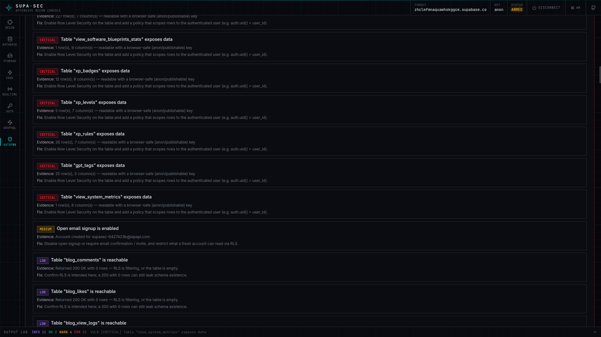
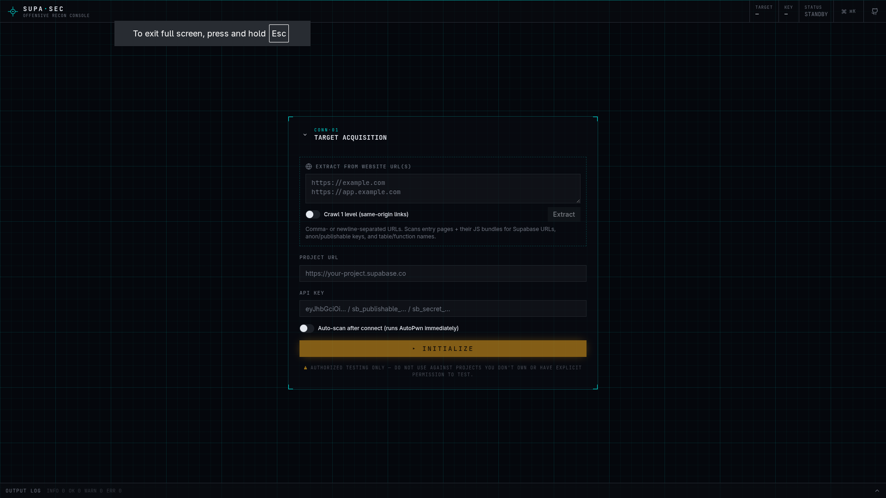
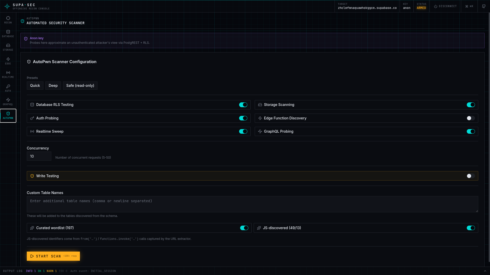

<p align="center">
  
</p>

<h1 align="center">supasec</h1>

<p align="center">
  <strong>Supabase security scanner for pentesters and red teams.</strong><br>
  Find exposed tables, broken RLS, open signups, leaky buckets, and unprotected edge functions — before attackers do.
</p>

<p align="center">
  <a href="https://github.com/berodcdev/supasec/blob/master/LICENSE"></a>
  = 22" />
  
  
</p>

<p align="center">
  <a href="#quick-start">Quick Start</a> · <a href="#features">Features</a> · <a href="#screenshots">Screenshots</a> · <a href="#how-it-works">How It Works</a> · <a href="#deploy">Deploy</a> · <a href="#contributing">Contributing</a>
</p>

---

> [!WARNING]
> **For authorized security testing only.** Do not use against projects you don't own or have explicit permission to test.

## Why supasec?

Supabase makes it easy to build apps fast — but that speed creates a massive surface for misconfiguration. Row-Level Security (RLS) policies are easy to get wrong, storage buckets default to restrictive but are often opened up "just for testing," and leaked API keys in JS bundles give attackers a direct line to your database.

**supasec** is a purpose-built toolkit that probes every attack surface of a Supabase project — the REST API, GraphQL, Storage, Auth, Edge Functions, and Realtime — and turns what it finds into actionable, ranked findings with evidence and remediation steps.

Inspired by [firepwn-tool](https://github.com/0xbigshaq/firepwn-tool) (Firebase), built from scratch for Supabase.

---

## Quick Start

### Docker (recommended)

```bash
git clone https://github.com/berodcdev/supasec.git
cd supasec
./install.sh
```

Open **http://localhost:3000** — done.

### From source

```bash
git clone https://github.com/berodcdev/supasec.git
cd supasec
npm install
npm run dev
```

### Install flags

| Flag            | Description                      |
| --------------- | -------------------------------- |
| `--port 8080`   | Custom port                      |
| `--yes`         | Skip confirmation prompts        |
| `--update`      | Rebuild and restart              |
| `--uninstall`   | Stop and remove everything       |

---

## Screenshots

<table>
  <tr>
    <td align="center"><strong>Target Acquisition</strong></td>
    <td align="center"><strong>AutoPwn Configuration</strong></td>
  </tr>
  <tr>
    <td></td>
    <td></td>
  </tr>
  <tr>
    <td colspan="2" align="center"><strong>Ranked Security Findings</strong></td>
  </tr>
  <tr>
    <td colspan="2" align="center"></td>
  </tr>
</table>

---

## Features

### Automated Scanning

- **AutoPwn** — One-click scan across 6 attack surfaces (Database, Storage, Auth, Edge Functions, Realtime, GraphQL) with configurable concurrency and scan presets (Quick / Deep / Safe)
- **Findings Engine** — Raw results become ranked vulnerabilities (CRITICAL → LOW) with evidence, remediation, and PII escalation
- **Scan History & Diff** — Compare scans to track what's fixed and what's new
- **Report Export** — Markdown or interactive HTML pentest reports with findings table, evidence, and remediation

### Config Extraction

- **Auto-Extract** — Paste any web app URL; supasec crawls JS bundles for Supabase URLs, API keys, `.from()` tables, `.rpc()` functions, and `.functions.invoke()` names
- **Chunk Following** — Follows lazy-loaded imports to find configs buried in code-split bundles
- **Self-Hosted Detection** — Identifies custom Supabase domains via `createClient()` calls and env patterns

### Database

- **Full CRUD Explorer** — SELECT / INSERT / UPDATE / DELETE with filter builder, fake-data auto-fill, and column picker
- **Table & Column Bruteforce** — 130+ common names when the OpenAPI schema is blocked, plus custom wordlists
- **RPC Invoker** — Discover functions from spec, auto-populate args, invoke
- **Relationship Traversal** — Embed selector probes foreign-key joins via `?select=*,related(*)` 
- **Mass-Assignment Test** — Inject role/admin fields to test privilege escalation
- **RLS Policy Analyzer** — Static analysis detects `USING (true)`, missing `WITH CHECK`, absent `auth.uid()`

### GraphQL

- **GraphQL Explorer** — Introspection, schema browser, query editor — probes schema exposure through pg_graphql

### Storage

- **Bucket Explorer** — List, browse, upload, download, delete, public/signed URLs
- **Deep Scan** — Recursive file enumeration with bulk download
- **Sensitivity Detection** — Flags dangerous bucket names and filenames (`.env`, `backup.sql`, `dump.tar.gz`)

### Auth

- **Full Auth Probing** — Sign-up, sign-in, anonymous auth, OAuth provider enumeration, password reset
- **Bearer Token Injection** — Test with intercepted JWTs

### Edge Functions

- **Invoke & Discover** — Call by name or bruteforce common function names
- **Secret Scanning** — Responses scanned for leaked credentials

### Realtime

- **Channel Monitor** — Subscribe to postgres_changes, broadcast, and presence
- **Payload Scanning** — Incoming events scanned for secrets and JWTs

### Intelligence

- **Sensitive Column Detection** — Flags `password`, `email`, `ssn`, `cpf`, `credit_card`, `api_key` with PII badges
- **Secret Value Scanning** — Detects JWTs, AWS keys, Stripe keys, private keys in actual cell values
- **JWT Decoder** — Auto-decodes JWTs showing role/exp; flags `service_role` leaks as CRITICAL
- **Clue System** — All detections tagged as 🔎 CLUE with dedicated filter

### AI Analysis (optional)

- **AI Triage** — Send findings to an LLM (via OpenRouter) for automated verdicts, exploitability scores, and attack chain identification
- **Run PoC** — Generate and execute proof-of-concept cURL commands with real API keys injected

### Developer Experience

- **Command Palette (⌘K)** — Navigate modules, run actions, export reports
- **Copy-as-cURL** — Every operation has a curl copy button
- **Request History** — Replay any previous request
- **Output Log** — Color-coded, filterable, persistent (last 500 entries survive reloads)
- **Instrument-Grade UI** — Dark theme with monospace typography, datum corners, reticle marks, and boot animations

---

## How It Works

```
1. CONNECT          Paste a project URL + API key (or let Extract find them from a web app URL)
                    ↓
2. DISCOVER         Schema auto-detected via OpenAPI; bruteforce fills gaps
                    ↓
3. SCAN             AutoPwn probes Database, Storage, Auth, Edge, Realtime, GraphQL
                    ↓
4. ANALYZE          Findings engine ranks vulnerabilities; AI triage (optional) adds verdicts
                    ↓
5. REPORT           Export Markdown/HTML report with evidence and remediation steps
```

---

## Supported API Keys

| Key Type          | Prefix / Pattern                   | Access Level                                  |
| ----------------- | ---------------------------------- | --------------------------------------------- |
| Publishable       | `sb_publishable_`                  | Low privilege — schema blocked, use bruteforce |
| Secret            | `sb_secret_`                       | Elevated — bypasses RLS                       |
| Anon (JWT)        | `eyJ...` with `role: anon`         | Low privilege — schema accessible             |
| Service Role (JWT)| `eyJ...` with `role: service_role` | Elevated — bypasses RLS                       |

Key type is auto-detected and shown in the connection header.

---

## Deploy

For team/server deployments with authentication:

| Stack                      | Reverse Proxy | Auth       |
| -------------------------- | ------------- | ---------- |
| `docker-compose.prod.yml`  | Caddy         | Authelia (TOTP) |
| `docker-compose.srv1.yml`  | Traefik v3    | Authelia (TOTP) |

Both include healthchecks and automatic HTTPS. See [deploy/README.md](deploy/README.md) for configuration.

---

## Tech Stack

| Layer           | Technology                          |
| --------------- | ----------------------------------- |
| Framework       | Next.js 16, React 19               |
| Language        | TypeScript 5 (strict)              |
| Styling         | Tailwind CSS v4                    |
| Components      | shadcn/ui (Radix primitives)       |
| Supabase Client | @supabase/supabase-js v2           |
| Command Palette | cmdk                               |
| Testing         | Vitest                             |
| Container       | Docker multi-stage + Compose       |

---

## Project Structure

```
app/
  api/extract-config/    Config extraction (crawls JS bundles)
  api/ai-analyze/        OpenRouter streaming proxy
  api/run-poc/           PoC execution proxy
  api/health/            Docker healthcheck

components/supasec/
  init-form.tsx          Connection + Extract Config
  recon-dashboard.tsx    Overview dashboard
  database-explorer.tsx  CRUD, bruteforce, embed, escalate
  graphql-explorer.tsx   GraphQL introspection + queries
  storage-explorer.tsx   Bucket & file operations
  edge-functions.tsx     Edge function invoke + discovery
  realtime.tsx           Channel subscriptions
  auth-panel.tsx         Auth testing
  autopwn.tsx            Automated scanner + findings
  ai-analysis.tsx        AI triage + PoC runner
  command-palette.tsx    ⌘K command palette
  shared/                Reusable components

lib/
  findings.ts            Scan → ranked vulnerabilities
  sensitive.ts           PII + secret detection + JWT decode
  rls.ts                 RLS policy analyzer
  scan-history.ts        Persistence + diff engine
  scan-report.ts         Report generator (MD + HTML)

deploy/                  Production stacks (Caddy/Traefik + Authelia)
```

---

## Contributing

Contributions are welcome! See [CONTRIBUTING.md](CONTRIBUTING.md) for guidelines.

---

## Security

Found a vulnerability in supasec itself? See [SECURITY.md](SECURITY.md) for responsible disclosure.

---

## License

[MIT](LICENSE) — use it, fork it, break things (with permission).
